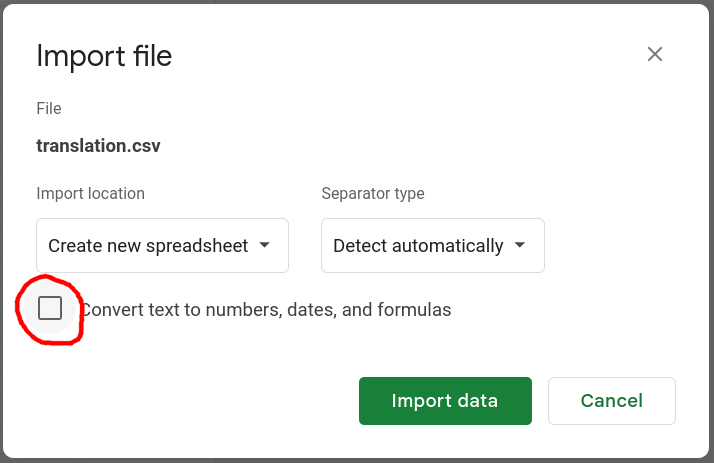

A future home for translation-focused tools for the shin engine.

I've already made a few tools for this engine:

- [shin](https://github.com/DCNick3/shin) - a reimplementation of the umineko version of shin engine and `sdu` - a
  companion tool for extracting game data
- [ShinDataUtil](https://github.com/DCNick3/ShinDataUtil) - a comprehensive tool for extracting and repacking the game
  data

However, they target relatively modern versions of the engine (the former - switch's umineko, the latter - switch's
higurashi).

The aim of this project is to provide tools that cover a wider range of versions.

As a starting point I'm targeting the "AstralAir no Shiroki Towa -White Eternity-" version of the engine.

## Features

- Extraction and compilation of ROM files compatible with, AFAIK, all* versions of the engine
- Translation of the game script (SNR files). See [game support](#game-support) section to find out which games are
  supported

\* except for PS2 versions, which embed rom files directly onto the disc

In the future I plan to implement more engine versions for the SNR translation tool, and maybe make a multi-version tool
for working with graphics (PIC and TXA).

## Installation

### Binary release

Download a release from the [releases page](https://github.com/DCNick3/shin-translation-tools/releases).

For Linux/macOS use the shell script installer. For Windows use either the powershell or msi installer.

### From source

```bash
cargo install --path shin-tl
```

### Shell completion

To enable shell completion, generate the completion script and source it in your shell

For linux shells:

```bash
shin-tl generate-completion bash > ~/.local/share/bash-completion/completions/shin-tl
shin-tl generate-completion zsh > ~/.local/share/zsh/site-functions/_shin-tl
shin-tl generate-completion fish > ~/.config/fish/completions/shin-tl.fish
```

For powershell:

```powershell
shin-tl generate-completion powershell >> $PROFILE
```

Then re-start the shell or source the generated file

## Game support

Although ROM files are supported for all versions of the engine, the SNR translation tool requires support for each game
separately. See "shin-tl snr support" column
in [this spreadsheet](https://docs.google.com/spreadsheets/d/1wGX9FOQq_iXcWMnY9qITCAV7hq1R7_gpWwjkT4_tKDI/edit#gid=0) to
find out which games are supported.

Af of writing this readme, vita versions of "AstralAir no Shiroki Towa -White Eternity-", "ALIA's CARNIVAL!
Sacrament" and "Higurashi no Naku Koro ni Sui" along with switch version of "D.C.4 -Da Capo 4-" are supported.

Note that for games that have `commands style` set to `unescaped` (like ALIA's CARNIVAL! and Higurashi Sui) you will
probably want to convert the command styles as outlined
in [this section](#dealing-with-ascii-characters-in-older-games).

If you want to translate some other games this engine uses, let me know, so I can prioritize support for that game.

## Usage

### Preparation

First of all, you would need the game files. How you obtain it differs by the platform.

On Switch, you would need to first dump the game with [nxdumptool](https://github.com/DarkMatterCore/nxdumptool) and
then extract the romfs files with [hactoolnet](https://github.com/Thealexbarney/LibHac).

When dealing with PS Vita files, make sure that you have the files decrypted.

shin engine usually packages its files into one or two `.rom` files: `data.rom` and sometimes `patch.rom`. You would
need to obtain them first.

After you have obtained the rom files, `shin-tl` can already handle them

### Extracting the rom files

To extract the rom files, use a command like this:

```bash
shin-tl rom extract <data.rom> <rom-dir>
```

This will create the `rom-dir` directory and extract the rom files into it.

The game stores its data in multitude of formats. The ones that are the most interesting for translation are:

- `SNR` - the game script
- `PIC` - pictures (mostly CGs)
- `TXA` - texture archives (mostly UI elements)
- `FNT` - fonts

As of now, shin-tl can only be used to translate the game script (`SNR` files).

### Translating the SNR files

1. Extract the strings

To extract strings from the snr file into a csv file, use a command like this:

```bash
shin-tl snr read <engine-version> <main.snr> <strings.csv>
```

The format of the SNR files varies greatly with the engine version, and it does not contain any indicators as to which
version it is. Thus, you need to supply the engine version to the tool.

See "shin-tl name" column
of [this spreadsheet](https://docs.google.com/spreadsheets/d/1wGX9FOQq_iXcWMnY9qITCAV7hq1R7_gpWwjkT4_tKDI/edit#gid=0)
corresponding to your game to find out what to put here.

The `strings.csv` file will contain the extracted strings. It can be edited with a spreadsheet editor like Excel or
LibreOffice Calc.

Here's how it will look like:

```csv
index,offset,source,source_subindex,s,translated
<...>
53,0x00037e62,saveinfo,0,共通ルート,
54,0x00037e71,saveinfo,0,プロローグ,
55,0x00037f15,msgset,1,@rここは自由に駆け回れる庭だった。,
56,0x00037f3a,msgset,2,@r好きに生きることを許された世界だった。,
57,0x00037f62,msgset,3,@rそれ以上に求めるものはない。,
58,0x00037f82,msgset,4,@rやわらかい雪の上に、想うだけ足跡をつけたなら、この心は簡単に満たされる。,
<...>
```

The `index` column is used to later inject the translated strings back into the SNR file, while `offset`, `source`
and `source_subindex` provide information about where the string comes from.

If you are using a spreadsheet editor, take care to avoid conversion of the columns to numbers, as it will break the
tool.

In case of Google Spreadsheets, make sure to uncheck the "Convert text to numbers, dates and formulas" option when
importing the csv:



2. Inject the translated strings back

Create a translation csv by either putting your translation into the `translated` column, or modifying the `s` column
directly. The `translated` column will take precedence over the `s` column.

To inject the translated strings back into the snr file, use a command like this:

```bash
shin-tl snr rewrite <engine-version> <main.snr> <translation.csv> <main_translated.snr>
```

This will read the translation csv, replace the strings in the snr file and write the result to `main_translated.snr`.

### Rebuild the rom file

After touching all the files you wanted to translate, you would need to package them back into a `.rom` file.

All games I saw so far load the `patch.rom` file on top of `data.rom` (even if in original distribution there's
no `patch.rom`). It also tends to be smaller, so you almost definitely want to put your translated files
into `patch.rom`.

To rebuild the rom file, use a command like this:

```bash
shin-tl rom create --rom-version <rom-or-game-version> <rom-dir> <patch.rom> 
```

This will package all files and directories inside `rom-dir` into a `patch.rom` file.

Note that the rom format varies from game to game, so you need to supply either the rom format (`rom1-v2-1`, `rom2-v1-0`
or `rom2-v1-1`) or the engine version to the tool. You can see the correspondence
in [this spreadsheet](https://docs.google.com/spreadsheets/d/1wGX9FOQq_iXcWMnY9qITCAV7hq1R7_gpWwjkT4_tKDI).

After that, you can put the `patch.rom` file back into the game (however it is done on the platform you are working
with).

On Switch you would use LayeredFS mods to do that.

## Message format

Some strings can contain layout commands. These are strings for `MSGSET`, `LOGSET` and `SELECT` commands (they
correspond to `msgset`, `logset` and `select_choice` values of `source` column in the CSV). They are interleaved with
regular text and can change the way the text looks or perform some actions when reached.

All commands are represented by a single lowercase ASCII character. Some of them have a single argument that starts
immediately after the command character and is terminated by `.`. Argument can be a string (then it's treated literally)
or a number (then it is parsed either as a decimal number or, if prefixed by `$`, as a hexadecimal).

I am aware of two styles of the commands used in different versions of the engine:

- Escaped. The more modern one, prefixes all commands with `@`. Example: `語り手@r@vhello.Hello.`
- Unescaped. Can be found in order versions, all ASCII characters are implicitly treated as commands. `!` can be used to
  escape those. Example: `語り手rvhello.!H!e!l!l!o.`

One version only ever uses a single style. You can see which is which in
the [game spreadsheet](https://docs.google.com/spreadsheets/d/1wGX9FOQq_iXcWMnY9qITCAV7hq1R7_gpWwjkT4_tKDI).

For documentation on which commands does what, you can
check [this spreadsheet](https://docs.google.com/spreadsheets/d/1HNYDUVUSKz9JTHieH7t8zYIt06KFTeOxExSCO6ZjatU/edit#gid=1796226786).

### Dealing with ASCII characters in older games

As you might have noticed, making translation with unescaped command style to any language that uses ASCII characters
`!c!a!n! !b!e! !c!u!b!m!e!r!s!o!m!e`. This is why `shin-tl` can seamlessly convert the scenario to the escaped format
and back.

To use this, pass `--message-style modernize` parameter to __both__ the `snr read` and `snr rewrite`. The `read` will
now generate a CSV file in the escaped format (prefixing all commands with `@`), while `rewrite` will convert it back to
equivalent unescaped form, using `!` to escape all literal ASCII characters.

Note that if you don't pass `--message-style modernize` to `snr rewrire`, the tool will generate an SNR file with
escaped commands that the engine won't be able to parse correctly. Hopefully, the enabled-by-default linting should help
you detect this.

## Alternatives

There are alternatives to this project, which support other versions of the engine:

- [ShinDataUtil](https://github.com/DCNick3/ShinDataUtil) (by me) has full support for (almost?) all formats used by
  switch's Higurashi Hou and Konosuba
- [sdu](https://github.com/DCNick3/shin#what-else-is-in-the-box) (also by me) has support for extraction (but not
  creation) of most formats used by switch's Umineko
- [enter_extractor](https://github.com/07th-mod/enter_extractor) (by 07th-mod) has support for extraction and patching
  of most formats across several versions of the engine
- [kaleido](https://gitlab.com/Neurochitin/kaleido/) (by Neurochitin) has support for scenario translation of vita's
  umineko and vita and switch's Kaleido. There's also code to generate FNT files

## License

Licensed under Mozilla Public License 2.0. See [LICENSE](LICENSE) for more information.

## Disclaimer

This is a fan project to enable unofficial translations of shin-based games. It is by no means affiliated with
Entergram, Dramatic Create, Alchemist or any other rightsholder.
