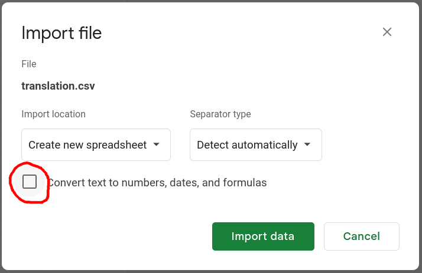

Only supports PS Vita version of AstralAir no Shiroki Towa -White Eternity- (PCSG00901) for now. Support for other shin-based games is possible to add.

## Installation

### Binary release

Download the latest release from the [releases page](https://github.com/DCNick3/shin-translation-tools/releases).

### From source

```bash
cargo install --path shin-tl
```

### Shell completion

To enable shell completion, generate the completion script and source it in your shell

For linux shells:

```bash
shin-tl generate-completion bash > ~/.local/share/bash-completion/completions/shin-tl
shin-tl generate-completion zsh > ~/.local/share/zsh/site-functions/_shin-tl
shin-tl generate-completion fish > ~/.config/fish/completions/shin-tl.fish
```

For powershell:

```powershell
shin-tl generate-completion powershell > "$env:USERPROFILE\Documents\WindowsPowerShell\Modules\shin-tl.ps1"
```

Then re-login or source the generated file.

## Usage

### Preparation 

1. Extract the game's rom files (usually either one `data.rom` file or a `data.rom` and `patch.rom` pair)
2. Extract the ROM files (TODO: make a multi-version tool for this, for now use `blabla.py` from 07th-mod's [enter_extractor](https://github.com/07th-mod/enter_extractor/blob/master/blabla.py))
3. Locate the `main.snr` file in the extracted files

The `main.snr` is the file containing the game script and is the one of the main things to translate.

### Extract strings

To extract strings from the snr file into a csv file, use a command like this: 

```bash
shin-tl snr read <engine-version> <main.snr> <strings.csv>
```

The engine version is the version of the engine used by the game. Only AstralAir no Shiroki Towa -White Eternity- is supported for now, so it should be `white-eternity`.

The `strings.csv` file will contain the extracted strings. It can be edited with a spreadsheet editor like Excel or LibreOffice Calc.

Here's how it will look like:

```csv
index,offset,source,source_subindex,s,translated
<...>
53,0x00037e62,saveinfo,0,共通ルート,
54,0x00037e71,saveinfo,0,プロローグ,
55,0x00037f15,msgset,1,@rここは自由に駆け回れる庭だった。,
56,0x00037f3a,msgset,2,@r好きに生きることを許された世界だった。,
57,0x00037f62,msgset,3,@rそれ以上に求めるものはない。,
58,0x00037f82,msgset,4,@rやわらかい雪の上に、想うだけ足跡をつけたなら、この心は簡単に満たされる。,
<...>
```

The `index` column is used to later inject the translated strings back into the SNR file, while `offset`, `source` and `source_subindex` provide information about where the string comes from.

If you are using a spreadsheet editor, take care to avoid conversion of the columns to numbers, as it will break the tool.

In case of Google Spreadsheets, make sure to uncheck the "Convert text to numbers, dates and formulas" option when importing the csv:



### Inject the translated strings back

Create a translation csv by either putting your translation into the `translated` column, or modifying the `s` column directly. The `translated` column will take precedence over the `s` column.

To inject the translated strings back into the snr file, use a command like this:

```bash
shin-tl snr rewrite <engine-version> <main.snr> <translation.csv> <main_translated.snr>
```

This will read the translation csv, replace the strings in the snr file and write the result to `main_translated.snr`.

### Rebuild the rom files

You then would need to put the translated file back into the rom. I am not aware of any tools that can produce files compatible with the White Eternity version of the engine. I will probably write one later.

What works for now is to find the offset of the original `main.snr` file in the rom, and replace it with the translated `main_translated.snr` file and manually overwrite it in a hex editor. This won't work if the translated file is larger than the original one, so a proper tool should be made.

Also, for the most games, it makes sense to patch the `patch.rom` file instead, as it is usually smaller, and it takes precedence over the `data.rom` file.

In White Eternity there's no `patch.rom` file in the original distribution, but the engine will still load it if it's present.